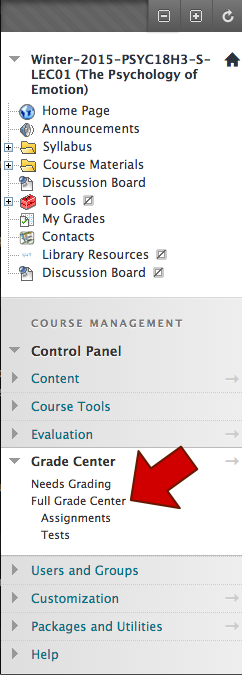
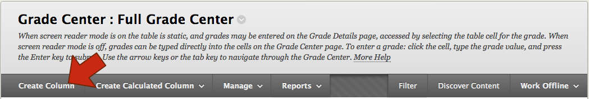
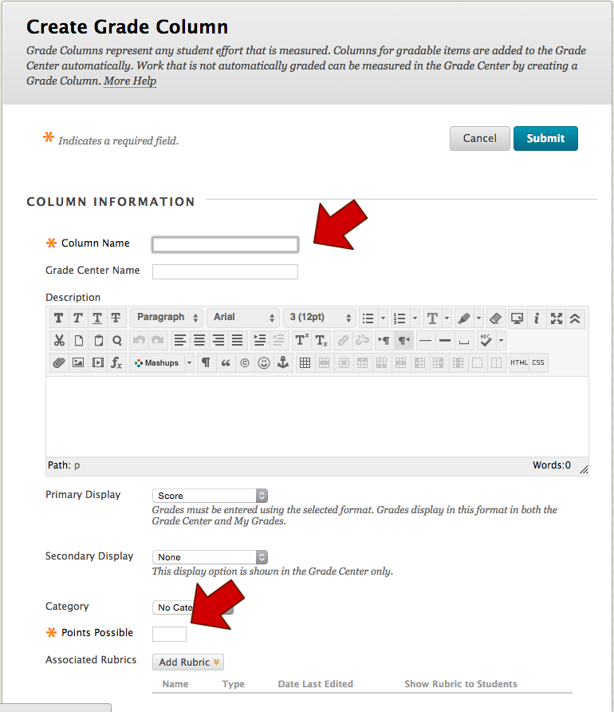
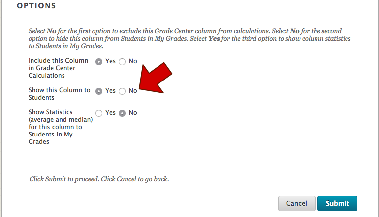
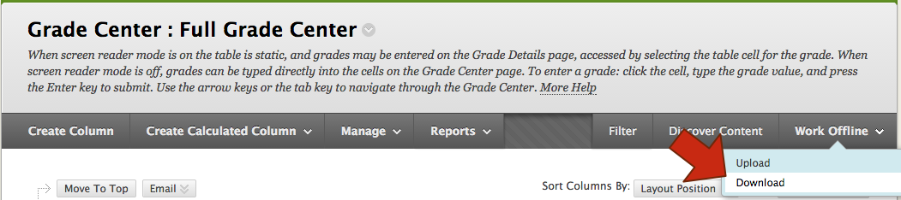
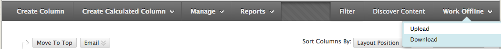

# BSB: Blackboard

The **Blackboard Guide** walks through common operations with Blackboard.  There are several complex processes the Blackboard must facilitate, and there are so many irregular options that it is confusing.

### Open the Full Grade Center

### Create a Column

### Add Column Details

### Do not show column

### Work Offline

### Download Grades

### Upload Grades

## Next Steps

To use Blackboard with BSB, follow the [Usage Guide](Usage.md).
